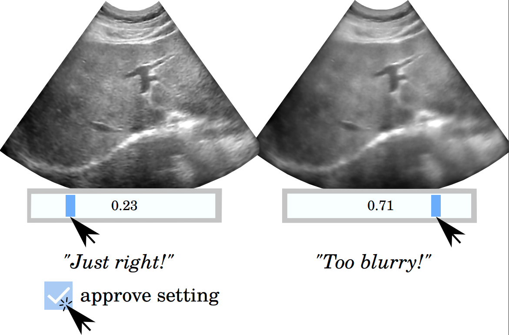

# Ultrasound Design Gallery


The Ultrasound Design Gallery is a graphical tool for tuning medical ultrasound image enhancement algorithms.

## Dependencies
* C++-20 compatible compiler
* CUDA-enabled GPU
* CUDA toolkit with nvcc
* OpenCV with CUDA enabled
* [Imgui](https://github.com/ocornut/imgui)
* [sfml](https://www.sfml-dev.org/)
* [Imgui-sfml](https://github.com/eliasdaler/imgui-sfml)
* [Blaze](https://bitbucket.org/blaze-lib/blaze)
* (optionally for tests) [Catch2](https://github.com/catchorg/Catch2)

## Installation

First, install all the dependencies above.
Then, run the following commands.

```sh
git clone --recursive https://github.com/Red-Portal/UltrasoundDesignGallery.git
mkdir build && cd build 
cmake -DCMAKE_CXX_FLAGS="-std=c++20" \
	-DCMAKE_CUDA_ARCHITECTURES=<CUDA Architecture> \
	-DSFML_DIR=<SFML Directory> \
	-G "Unix Makefile" ..
make
```

In some unfortunate cases, the compiler supporting C++-20 isn't compatible the CUDA toolkit.
Then, use a different compiler for the CUDA compiled parts.
For example, on Ubuntu 20.04 with a GTX 2080 ti GPU, the following combination of clang and gcc works.

```sh
git clone --recursive https://github.com/Red-Portal/UltrasoundDesignGallery.git
mkdir build && cd build 
cmake -DCMAKE_CUDA_HOST_COMPILER=clang++-11 \
	-DCMAKE_CXX_COMPILER=g++-11 \
	-DCMAKE_CXX_FLAGS="-std=c++20" \
	-DCUDA_NVCC_FLAGS="-allow-unsupported-compiler" \
	-DCMAKE_CUDA_ARCHITECTURES=7.5 \
	-DSFML_DIR=<SFML Directory> \
	-G "Unix Makefile" ..
make
```

## Project Structure
| Path  | Description  |
|:--|:--|
| scripts/ | Julia implementations of various diffusion algorithms |
| paper/ | Latex source for the Ultrasound Design Gallery paper |
| src/bo | Bayesian optimization |
| src/gp | Latent Gaussian process |
| src/imaging | Image processing algorithms |
| src/inference | Bayesian inference algorithms |
| src/math | Various mathematical primitives |
| src/system | Debugging and profiling primitives |
| src/ui | User interface and main routine |
| resource/ | Resources including fonts, icons, screenshots |
| test/ | Unit tests |
| third_party/ | Submodule dependencies |

Gaussian process hyperparmeters are set in `src/bo/fit_gp.hpp` ([link](https://github.com/Red-Portal/UltrasoundDesignGallery/blob/8a2e83cc3cc7a1db3f00cce266bc7832d05ac0e4/src/bo/fit_gp.hpp#L32)).
Bayesian optimization hyperparmeters and computational budgets are set in `src/ui/optimization_manager.hpp` ([link](https://github.com/Red-Portal/UltrasoundDesignGallery/blob/8a2e83cc3cc7a1db3f00cce266bc7832d05ac0e4/src/ui/optimization_manager.cpp#L34)).

## Usage

Select a directory in [File] -> [Open].
The directory must contain a *single* png file containing the roi mask and multiple PFM (Portable FloatMap) files.
Each pfm file is used as a single frame of the sequence, and its intensity is assumed to be in [0, 1].
The pfm files are sorted in natural order before being played.



After opening a sequence, you can freely interact with the UI as shown in the illustration above.

## License

```
    Copyright (C) 2021 Ray Kim

    This program is free software: you can redistribute it and/or modify
    it under the terms of the GNU General Public License as published by
    the Free Software Foundation, either version 3 of the License, or
    (at your option) any later version.

    This program is distributed in the hope that it will be useful,
    but WITHOUT ANY WARRANTY; without even the implied warranty of
    MERCHANTABILITY or FITNESS FOR A PARTICULAR PURPOSE.  See the
    GNU General Public License for more details.

    You should have received a copy of the GNU General Public License
    along with this program.  If not, see <https://www.gnu.org/licenses/>.
```

